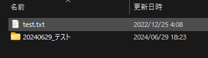

# 日付フォルダ

日付フォルダの時系列

## 機能

最終編集日に基づいた日付をフォルダ名の先頭に追加・削除します。

## 使い方

### 日付の付いていないフォルダの場合

エクスプローラでフォルダを選択し、拡張コンテキストメニュー(`SHIFT＋コンテキストメニューキー`、または `SHIFT＋F10`)を開きます。
コンテキストメニューから「`日付フォルダに変更(H)`」を選択します。

時系列のコードの付いたフォルダ名に変更にされます。  

### 日付の付いたフォルダの場合

エクスプローラでフォルダを選択し、コンテキストメニューから「`日付フォルダを戻す(H)`」を選択することにより、先頭の日付部分を削除することができます。

### バックグラウンドを選択

バックグラウンドを選択し、コンテキストメニューから「`日付フォルダ作成(H)`」を選択することにより、先頭に日付の付いたフォルダを作成することができます。

説明を入力します。説明を省略した場合、日付だけのフォルダを作成します。  

説明をファイル名にした日付フォルダが作成されます。

## 機能詳細

ルールを次のように定義しました:

* 日付の付いていないフォルダ名の先頭に日付を追加します。
* 日付の付いたフォルダ名の場合は日付を削除します。  
　日付の付いていないフォルダ名の例) test  
　日付の付いたフォルダ名の例) 20221225_test

ツールの動作を次のように定義しました:

* フォルダの先頭に日付(時系列コード)を与えます。
* 時系列のコードは、年、月、日、編集日内の記録順に文字で構成されます。  
  (例:20210901、20210901a)
* 時系列のコードは、フォルダ内の有効なファイルの最新編集日とします。
* フォルダ内の次のファイル名は有効なファイルとして扱いません。
  * 先頭が「~(チルダ)」で始まる名前
  * 先頭が「.(ピリオド)」で始まる名前
  * 先頭が「_(アンダーバー)」で始まる名前
* フォルダ内に有効なファイル名が無い場合は現在の日付とします。
