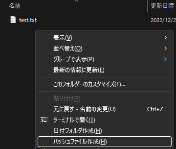
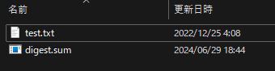
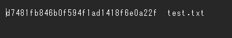
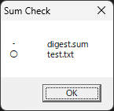
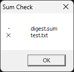

# ハッシュファイル

ハッシュファイル作成、およびハッシュ値比較

## 機能

フォルダからハッシュファイルの作成、およびハッシュファイルからファイルのハッシュ値の比較を行います。

## 使い方

    このツールによるハッシュ値計算は、簡易的な実装です。  
    ファイルサイズが巨大だったり、ファイル数が多数だったり、特殊ファイルだったりは考慮されていません。このような場合は、md5sum や sha1sum などを使用してください。  
    また、アーカイブツールなどに付属機能で同等のことができる場合は、そちらをお勧めします。

### フォルダからハッシュファイルの作成

バックグラウンドを選択し、コンテキストメニューから「`ハッシュファイル作成(H)`」を選択することにより、フォルダ内のファイルのハッシュファイルを作成することができます。  
ハッシュファイルのハッシュ値は、`MD5` とします。

ハッシュファイル `digest.sum` を作成されます。

ハッシュファイル `digest.sum` は、メモ帳で開くことが可能で、  フォルダ内にあるファイル毎のハッシュ値とファイル名のリストになります。

### ハッシュファイルからファイルのハッシュ値の比較

エクスプローラでハッシュファイルを選択し、`ENTER` またはダブルクリックします。  
フォルダにあるファイルのハッシュテストを行い、結果を表示します。

ハッシュテストが成功したファイルは 「〇」 が表示されます。

ハッシュテストが失敗したファイルは 「×」 が表示されます。

