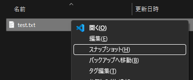
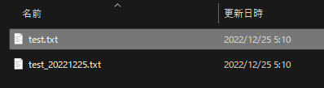
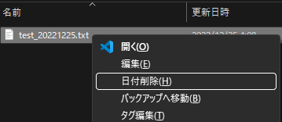
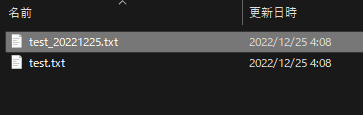

# スナップショット

編集中ドキュメントのスナップショット作成  

## 機能

最終編集日をファイル名の末尾に付けたファイル(スナップショット)に複製します。
既に付いているファイルの場合は、日付部分を削除したファイルを複製します。

## 使い方

    注:編集中のドキュメントは、こまめに保存して下さい。
    (アプリのクラッシュや電源OFFなどにより編集した内容がなくならないように)

### ファイル名に日付情報のついていないファイルの場合

エクスプローラでファイルを選択し、コンテキストメニュー(`コンテキストメニュー`キー、または `SHIFT＋F10`)を開きます。
コンテキストメニューから「`スナップショット(H)`」を選択します。

時系列のコードのついたファイルが複製されます。

### ファイル名に日付情報のついているファイルの場合

エクスプローラでファイルを選択し、コンテキストメニュー(`コンテキストメニュー`キー、または `SHIFT＋F10`)を開きます。
コンテキストメニューから「`日付削除(H)`」を選択します。

日付部分を削除したファイルが複製されます。

## 機能詳細

* ファイル名に日付情報のついていないファイルの場合：  
　元ファイル： test.txt  
　複製するファイル： test_20221225.txt
* ファイル名に日付情報のついているファイルの場合：  
　元ファイル： test_20221225.txt  
　複製するファイル： test.txt

ツールは次の動作します:

* スナップショットは、ファイル名に時系列コードを与えます。
* 時系列のコードは、年、月、日、編集日内の記録順文字(なし,a,b,c,...)で構成します。  
  (例:20210901、20210901a)
* 時系列のコードを与えたドキュメントファイルは、読み込み専用にします。
