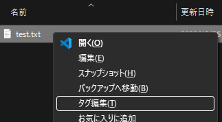
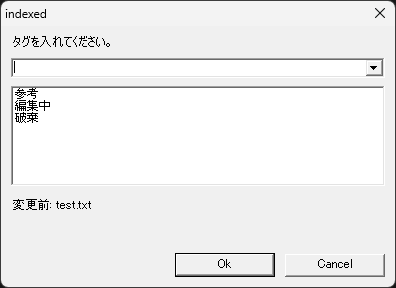
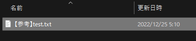
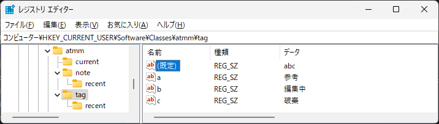

# タグ

ファイルの作業状態を表示

## 機能

ファイル名の先頭に作業状態を設定します。

## 使い方

エクスプローラでファイルを選択し、コンテキストメニュー(`コンテキストメニュー`キー、または `SHIFT＋F10`)を開きます。
コンテキストメニューから「`タグ編集(T)`」を選択します。

タグ設定ダイアログが表示され、タグを入力し「OK」します。
タグを空にするとタグを削除します。  
タグの候補は以下がありますが、状態や分類を識別しやすい単語を使用します。  
入力欄の下にあるリストから、事前に登録したリストから選択することもできます。  
また、入力欄の右にある▼ボタンを選択して過去の入力履歴から選択することもできます。

|タグ|説明|
|----|----|
|参考|他から持ってきた参考資料を作業フォルダに置き、タグ付けして編集対象でないことを明示|
|編集中|共有しているファイルの場合などにおいて、編集中であることを周知したい時に明示|
|破棄|廃棄対象であることの明示|
|発行|編集後、発行したものであることの明示|
|(空)|タグは削除|
|||

ファイル名の先頭にタグが追加されます。

## タグのリストへの登録設定

タグのリストは、初期値として「参考」「編集中」「破棄」を登録しています。  
タグのリストへの登録は、レジストリを編集することで変更可能です。

    レジストリの変更は十分気を付けて行ってください。

キー： HKCU¥Sofutware¥Classes¥atmm¥tag

キーの下に、名前に1文字の英字を割り当て、値としてタグ文字列を設定します。
(規定)に表示順に名前を並べます。

## 機能詳細

ルールを次のように定義しました:

* ファイル名の先頭に状態を明記します。
* 状態は一つのみとします。

ツールの動作を次のように定義しました:

* 状態は括弧で囲みます。
